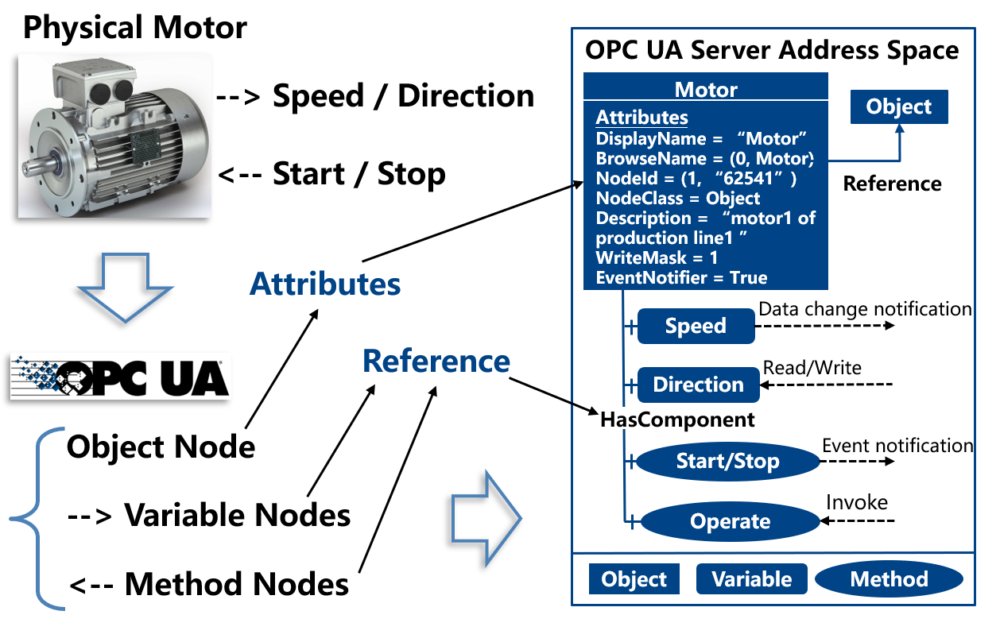
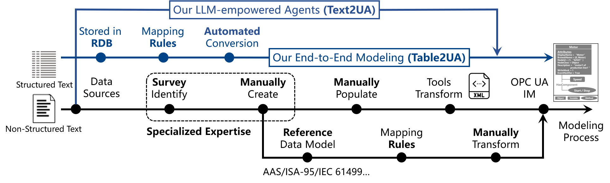
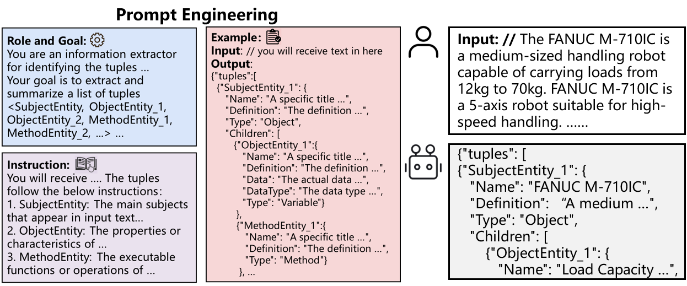
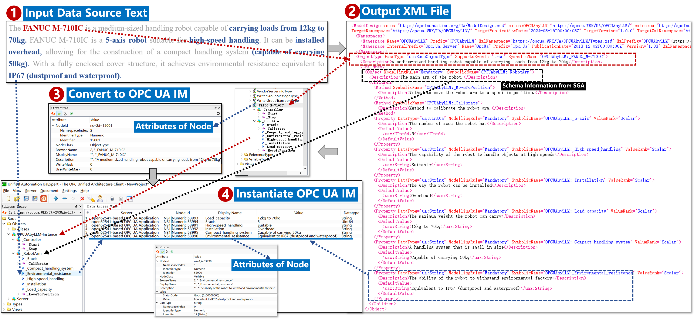
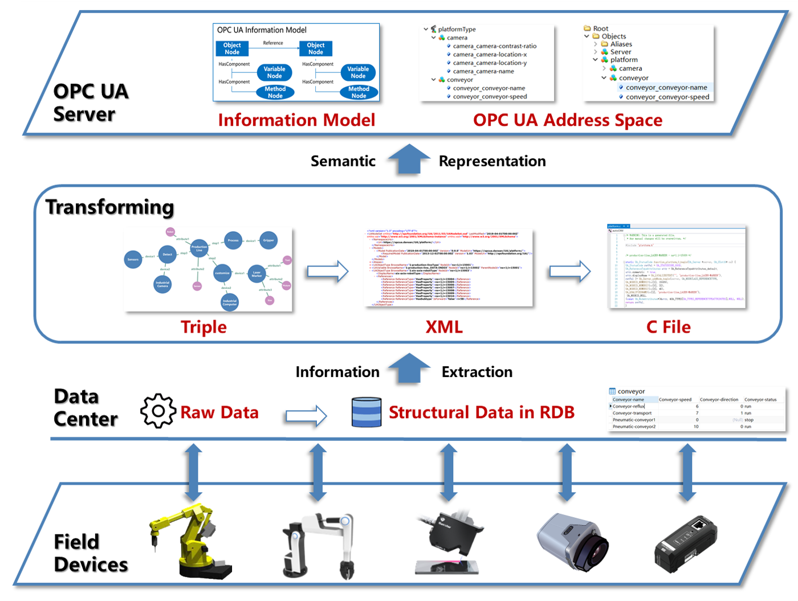
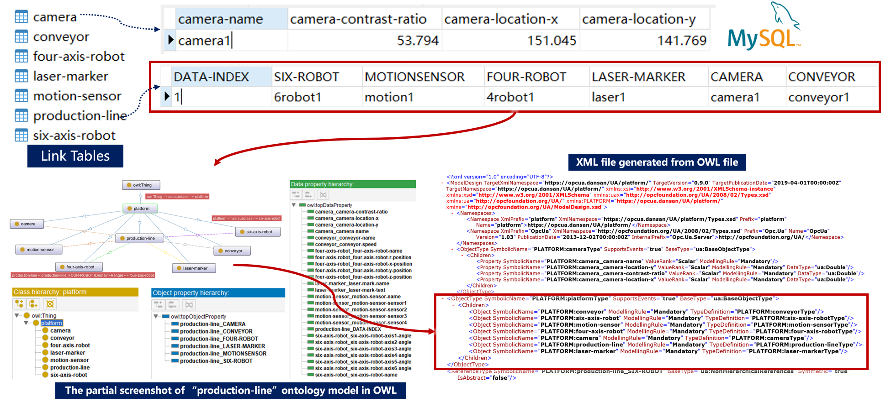

# Text2UA
Official implementation for "Text2UA: Automatic OPC UA Information Modeling from Textual Data with Large Language Model" (JAS-2024). 

# Text2UA (Automated OPC UA Information Modeling from Text)
> [**JAS-24**] [**Text2UA: Automatic OPC UA Information Modeling from Textual Data with Large Language Model**](https://www.ieee-jas.net/en/article/doi/10.1109/JAS.2025.125114)
>
> by [Rongkai Wang](https://scholar.google.com.hk/citations?hl=zh-CN&user=l-zF-W0AAAAJ),  [Chaojie Gu](https://scholar.google.com.hk/citations?hl=zh-CN&user=P7O3FpsAAAAJ), [Shibo He](https://scholar.google.com/citations?hl=zh-CN&user=5GOcb4gAAAAJ&view_op=list_works&sortby=pubdate), [Jiming Chen](https://scholar.google.com/citations?user=zK9tvo8AAAAJ&hl=zh-CN).


## Updates

- **12.12.2024**: Accept! Code is coming soon !!!
- **03.03.2025**：Early Access！

## Introduction 


We deals with automatically constructing an OPC UA information model (IM) aimed at enhancing data interoperability among heterogeneous system components within manufacturing automation systems. Empowered by the large language model (LLM), we propose a novel multi-agent collaborative framework to streamline the endto-end OPC UA IM modeling process. Each agent is equipped with meticulously engineered prompt templates, augmenting their capacity to execute specific tasks. We conduct modeling experiments using real textual data to demonstrate the effectiveness of the proposed method, improving modeling efficiency and reducing the labor workload. 

**Contributions:**
- *End-to-end efficient OPC UA information modeling method*
- *Compatible with multiple data sources*
- *Do not rely on a predefined reference data model*

## Motivation（Easy Build for OPC UA Information Modeling）


When using OPC UA, the first step is establishing IM for each physical component (e.g., devices) across systems. This process has several steps, including mapping object entities and their properties or operations to corresponding object, variable, or method nodes in IM, along with their respective node attributes (e.g., name, ID, description, default value, or datatype).

**Existing Methods' Limitations:**
1) Manually identifying and summarizing the information needed for modeling from data sources is a labor-intensive modeling method with low efficiency.
2) Mapping rule-based modeling methods require a reference data model established through prior manual efforts and are difficult to adapt to dynamic changes. 

## Data Source in Industrial Field
Data sources are divided into structured data (STD) and unstructured data (NSTD), utilized for describing device properties, production resource status, task requirements, etc. Modeling occurs in two scenarios:
1) **Known system components:** these components are currently in use and have generated data (e.g., STD: sheets or tables) representing their key properties or the system’s requirements. These data are represented through various structured pairs composed of text and their corresponding values (TVPs). In such cases, the IM can be directly modeled based on these TVPs.
2) **Unknown system components** (e.g., newly accessed devices): these components have not yet been put into use and require a survey or understanding of their properties or functions based on technical documents or specifications (i.e., NSTD). In this scenario, we need to extract useful information from relevant texts and create a reference template for OPC UA IM. 

## Overview of Multi-Agent Collabrative Modeling Framework(Text2UA)


- Information Extraction Agent (IEA): IEA is designed to extract information from both STD or NSTD data source texts (DST). We utilize prompt engineering to guide it to understand the semantic information of the text based on the contextual information of the entire DST. On this basis, it extracts and summarizes a list of tuples from the input text, including the Subject Entities (SEs) that serve as the primary descriptive objects of the text’s semantics, as well as multiple Object Entities (OEs) or Method Entities (MEs) that serve as properties or executable operations of SEs, respectively. In line with the LLM’s comprehension of input text, each entity is furnished with information concerning its “Name” and “Definition”. Furthermore, each OE is enriched with details regarding “Data” and “Data Type”.
- Evaluation Similarity Agent (ESA):  ESA is proposed to address the issue of incomplete information extraction resulting from the LLM’s inherent randomness. It mitigates this randomness by iteratively invoking the IEA to extract information from the same text. It then traverses the OEs and MEs of all generated tuples, merging similar entities while retaining distinct ones. All evaluations are rooted in the LLM’s comprehension of the “Name” and “Definition” information for each entity, thereby generating a new tuple. To avoid redundancy, we embed all OEs and MEs of the new tuple to obtain embedding vectors. Subsequently, we calculate their cosine similarity to identify similar entities and remove them.
- Schema Generation Agent (SGA): It creates the basic structured framework, called schema, of OPC UA IM for the target SE extracted in IEA, called Meta Subject Entity (MSE). For instance, if MSE is a robot arm, SGA can construct perspectives (i.e., SEs) related to its controller, arm, end effector, safety, or diagnostics. Simultaneously, SGA can also generate its generic operations (e.g., start or stop), representing MEs. This knowledge is derived from a pre-trained corpus, and each entity contains “Name” and “Definition” information.
- Synchronization Agent (SA): It receives the tuple generated in ESA and the schema generated in SGA. It evaluates the relevance between the “Name” and “Definition” information of all entities, populate the information of OEs and MEs from the tuple into the corresponding SEs or MSE from the schema, providing the associated reasons.
- Format Transform Agent (FTA): It converts the generated JSON data format from SA or IEA (when input STD) into XML data format, which is recommended for the normalized modeling process proposed by OPC Foundation. Through prompt engineering and tailored validation mechanisms for format and syntax, the generated XML conforms to the official OPC UA Nodeset XML Schema specification. It transforms the key-value pairs of MSE, SEs, OEs, and MEs from JSON into ObjectType, Object, Property, and Method elements of XML, respectively. The value of “Name”, “Definition”, “Data Value”, and “Data type” from JSON are incorporated into the content text of “SymbolicName”, “Description”, “DefaultValue”, and “DataType” elements of XML, respectively.

The IEA, ESA, SGA, and SA ultimately output hierarchical treelike key-value pairs in a JSON data structure format. Note that for STD, we directly use IEA and FTA to generate an XML file. The reason is that STD represents processed data, already containing the necessary information for modeling, thus obviating the need for additional information from other agents. The process of converting XML to OPC UA IM can be referenced to Table2UA.

## Promp Engineering Template


- Role and Goal: The role ensures that LLM possesses domain-specific knowledge, skills, and way of thinking relevant to the current task, while the goal provides a general description of the task requirements and functions performed by LLM.
- Instruction: it offers detailed requirements, considerations, and specifics of tasks, standardizing the actions of LLM in completing the target task.
- Example: it establishes standardized templates for inputs and outputs, ensuring that LLM produces results in the specified format. The descriptions of all prompt modules should be clear and direct. Moreover, compared to fixed mapping rules, the generalized templates of prompts can flexibly adapt to dynamically changing data sources

## Industrial dataset
Both STD generated by automation components in production processes and NSTD collected from the technical documents or websites of automation components are utilized for modeling. The textual STD includes 2 sensors, 2 actuators, 2 controllers, and 2 connectivity components with a total of 113 TVPs from [11]. The textual NSTD includes 4 robot arms, like ABB (A.), KUKA(K.), FANUC (F.), and YASKAWA (Y.), for discrete manufacturing and 4 typical chemical equipment, like Reactor (R.), Boiler (B.), Extractor (E.), and Distillator (D.), for process manufacturing.

## Main results

Case Study: We use “FANUC” robot arms of NSTD as input to validate Text2UA process with GPT-3.5.

## How to Run
### Generate the dataset 
Generate the dataset below:
Take xxxxx for example

Structure of xxx Folder:
```
xxx/
│
├── xxx
│   
└── ...
```

```bash
cd xxxx
python xxxx.py
```

### Run E2E-MAPPO
* Quick start 
```bash
xxxxxx
```
  
* Train your own model
```bash
xxxxxxxx
```


## Main results ()

## Dataset


## Thanks for code repository
<!-- * We re-program the DRL environment for multi-rewards feedback and single-step selection for FJSP.    AASbyLLM https://github.com/YuchenXia/AASbyLLM -->
* We thank for the code repository: [xxxx](xxxx)


## BibTex Citation

If you find this paper and repository useful, please cite our paper.

```
@articleInfo{JAS-2024-1271,
title = "Text2UA: Automatic OPC UA Information Modeling from Textual Data with Large Language Model",
journal = "IEEE/CAA Journal of Automatica Sinica",
volume = "12",
number = "JAS-2024-1271,
pages = "1",
year = "2025",
note = "",
issn = "2329-9266",
doi = "10.1109/JAS.2025.125114",
url = "https://www.ieee-jas.net/en/article/doi/10.1109/JAS.2025.125114",
author = "Rongkai Wang","Chaojie Gu","Shibo He","Jiming Chen"
}
```

## Table2UA (Using RDB to quickly construct OPC UA IM)
<!--  -->


Automatic implement RDB--OWL--XML--OPC UA Information Model. (Automated Scripts)

Please refer to [Leveraging Relational Database for Fast Construction of OPC UA Information Model](https://ieeexplore.ieee.org/document/9637064) | <u>Rongkai Wang</u>, [Shibo He](https://scholar.google.com/citations?hl=zh-CN&user=5GOcb4gAAAAJ&view_op=list_works&sortby=pubdate), Yang Liu, Chengwei Zhou, [Zhiguo Shi](https://person.zju.edu.cn/shizg/570480.html), [Jiming Chen](https://scholar.google.com/citations?user=zK9tvo8AAAAJ&hl=zh-CN). | Accepted by 2021 International Conference on Intelligent Technology and Embedded Systems (ICITES). Won the **Best Paper Award**!
