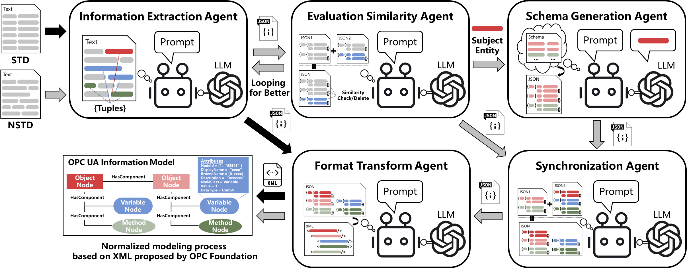

# E2E-MAPPO-for-MT-FJSP
Official implementation for "End-to-end Multi-target Flexible Job Shop Scheduling with Deep Reinforcement Learning" (IoTJ-2024). 

# E2E-MAPPO (Action without any Rules)
> [**IoTJ-24**] [**End-to-end Multi-target Flexible Job Shop Scheduling with Deep Reinforcement Learning**](https://ieeexplore.ieee.org/document/10734312)
>
> by [Rongkai Wang](https://scholar.google.com.hk/citations?hl=zh-CN&user=l-zF-W0AAAAJ), [Yiyang Jing](),  [Chaojie Gu](), [Shibo He](https://scholar.google.com/citations?hl=zh-CN&user=5GOcb4gAAAAJ&view_op=list_works&sortby=pubdate), [Jiming Chen](https://scholar.google.com/citations?user=zK9tvo8AAAAJ&hl=zh-CN).


## Updates

- **10.20.2024**: Accept! Code is coming soon !!!

## Introduction 
Modeling and solving the Flexible Job Shop Scheduling Problem (FJSP) is critical for modern manufacturing. However, existing works primarily focus on the time-related makespan target, often neglecting other practical factors such as transportation. To address this, we formulate a more comprehensive multi-target FJSP that integrates makespan with varied transportation times and the total energy consumption of processing and transportation. The combination of these multiple real-world production targets renders the scheduling problem highly complex and challenging to solve. To overcome this challenge, this paper proposes an end-to-end multi-agent proximal policy optimization (PPO) approach. First, we represent the scheduling problem as a disjunctive graph with designed features of sub-tasks and constructed machine nodes, additionally integrating information of arcs denoted as transportation and standby time, respectively. Next, we use a graph neural network (GNN) to encode features into node embeddings, representing the states at each decision step. Finally, based on the vectorized value function and local critic networks, the PPO algorithm and disjunctive graph simulation environment iteratively interact to train the policy network. Our extensive experimental results validate the performance of the proposed approach, demonstrating its superiority over the state-of-the-art in terms of high-quality solutions, online computation time, stability, and generalization.

## System architecture of MT-FJSP in Cloud-edge manufacturing paradigm
<!--  -->


## System model of MT-FJSP


## Overview of E2E-MAPPO


## Main results
 
 
 


## How to Run
### Generate the dataset 
Generate the dataset below:
Take xxxxx for example

Structure of xxx Folder:
```
xxx/
│
├── xxx
│   
└── ...
```

```bash
cd xxxx
python xxxx.py
```

### Run E2E-MAPPO
* Quick start 
```bash
xxxxxx
```
  
* Train your own model
```bash
xxxxxxxx
```


## Main results ()

### Industrial dataset
 


## We provide the reproduction of  [here]() 


* We re-program the DRL environment for multi-rewards feedback and single-step selection for FJSP. We thank for the code repository: [xxxx](xxxx)
* We thank for the code repository multi-policy DRL [xxxx](xxxx)


## BibTex Citation

If you find this paper and repository useful, please cite our paper.

```
@ARTICLE{10734312,
  author={Wang, Rongkai and Jing, Yiyang and Gu, Chaojie and He, Shibo and Chen, Jiming},
  journal={IEEE Internet of Things Journal}, 
  title={End-to-end Multi-Target Flexible Job Shop Scheduling With Deep Reinforcement Learning}, 
  year={2024},
  volume={},
  number={},
  pages={1-1},
  doi={10.1109/JIOT.2024.3485748}}

```
